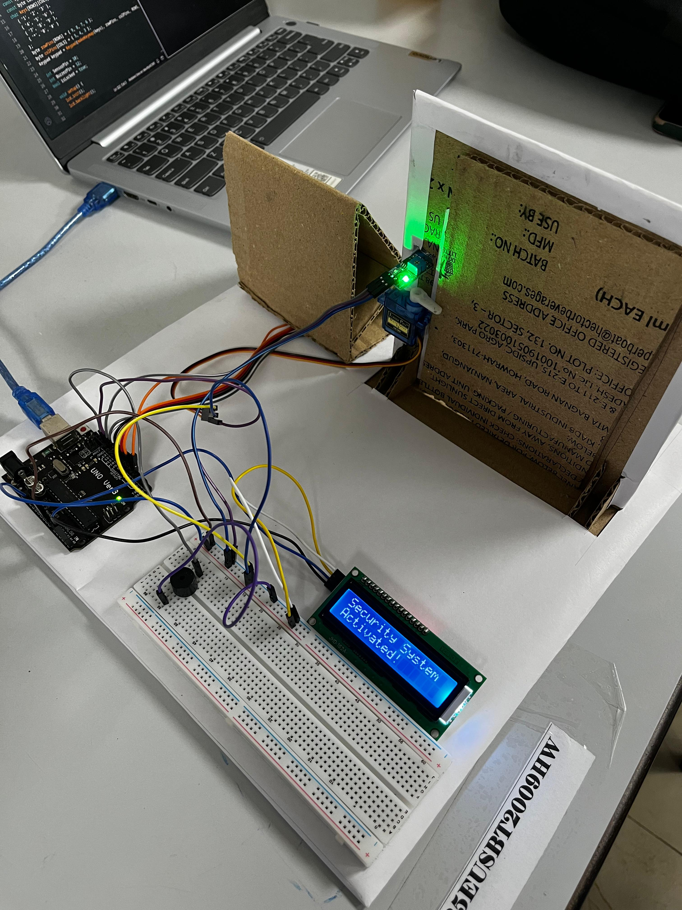

# Arduino-based Locking Mechanism

## Abstract

The project addresses the increasing theft and crimes faced in everyday life. This locking mechanism enhances traditional key-lock mechanisms by offering a safer, more convenient, and modern alternative.

Traditional locks are prone to:
- Lock-picking and mechanical wear  
- Rust or key loss  
- General inconvenience  

## Description

### Components:
- Arduino UNO
- Breadboard  
- Buzzer  
- Servo Motor  
- 3x4 Keypad  
- IR Sensor

### Assembly:
- Keypad: 7 output lines connected to Arduino’s digital pins.  
- IR Sensor: Power and ground connected to breadboard; digital output to pin D10.  
- Buzzer: Positive pin to D12, negative to ground. 
- Servo Motor: Power and ground to breadboard, signal to D11.  
- Power: Breadboard powered via Arduino’s 5V and GND pins.

---

